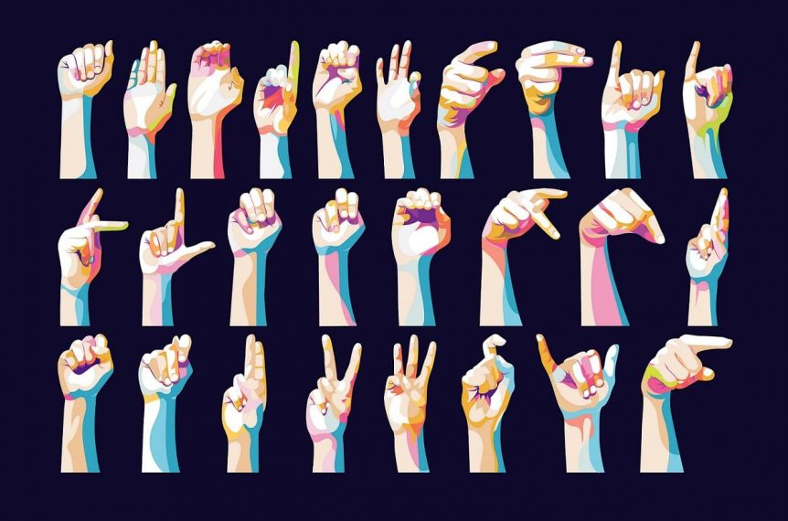

# Persian Sign Language Recognition - Real-Time Detection



This project implements a real-time Persian sign language recognition system using computer vision and machine learning. The model is trained to detect specific Persian sign language gestures and recognizes them from a live video feed. This implementation leverages `MediaPipe` for body and hand pose estimation and TensorFlow's `LSTM` model for sequence classification. 

## Project Overview

The objective is to enable real-time recognition of Persian sign language, capturing gestures and translating them into text. The pipeline involves:
1. **Pose and Hand Landmark Detection** - Using MediaPipe's holistic model to extract body and hand keypoints.
2. **Data Collection** - Creating a dataset of sign language gestures.
3. **Model Training** - Building and training an LSTM model to recognize gesture sequences.
4. **Real-Time Inference** - Running the model in real-time to detect gestures and display results.

## Features

- **Real-Time Detection**: Live video input from the webcam, processing and displaying recognized gestures instantly.
- **Customizable Actions**: Easily add more gestures to be recognized by extending the dataset and re-training the model.
- **Visualization**: Displays probabilities and recognized gestures in real time.

## Getting Started

### Prerequisites

To run this project, ensure you have Python installed along with the following libraries:

```bash
pip install numpy opencv-python mediapipe matplotlib tensorflow scikit-learn visualkeras
```

## Usage

### Step 1: Data Collection

Run the data collection cells in `RealTimeSignLanguageDetection.ipynb` to capture the necessary frames for each gesture. The script captures a sequence of frames for each gesture and stores it in the `MP_Data` directory.

### Step 2: Model Training

After collecting data, train the model by running the model training cells in the notebook. This uses an LSTM-based model to classify the sequences of keypoints.

### Step 3: Real-Time Detection

Once the model is trained, you can run the real-time detection section in the notebook. This opens the webcam feed and displays recognized gestures along with confidence scores in real time. To stop the feed, press `q`.

## Code Explanation

### Key Functions

- **mediapipe_detection**: Processes each frame to convert BGR to RGB and applies the MediaPipe model.
- **draw_landmarks & draw_styled_landmarks**: Draws landmarks on the frame to visualize the hand and body keypoints.
- **extract_keypoints**: Extracts the keypoints from the model's results, transforming them into a usable format.
- **prob_viz**: Visualizes the prediction probabilities for each gesture in the live video feed.

### Model Architecture

The LSTM model uses:
- Three LSTM layers with ReLU activations to learn temporal dependencies.
- Dense layers for final gesture classification.

The model is trained with `categorical_crossentropy` loss and `Adam` optimizer, saving the best model weights after training.

### Running TensorBoard

To monitor training progress, use TensorBoard by executing:
```bash
tensorboard --logdir=Logs/
```

## Results and Performance

After training, evaluate the model by running test predictions. The model’s accuracy and confusion matrices are printed to assess performance across the dataset. The accuracy and real-time performance may vary based on lighting conditions, camera quality, and model tuning.

## Future Improvements

- **Expand Dataset**: Add more gestures for comprehensive recognition.
- **Optimize Model**: Experiment with different model architectures or optimizers.
- **Gesture Feedback**: Implement audio feedback or translated text output for each gesture.

## License

This project is licensed under the MIT License. See `LICENSE` for more details.

## Acknowledgements

This project utilizes:
- [MediaPipe](https://google.github.io/mediapipe/) for pose estimation.
- [TensorFlow](https://www.tensorflow.org/) for machine learning model building.
- Special thanks to the open-source community for datasets and tools.

